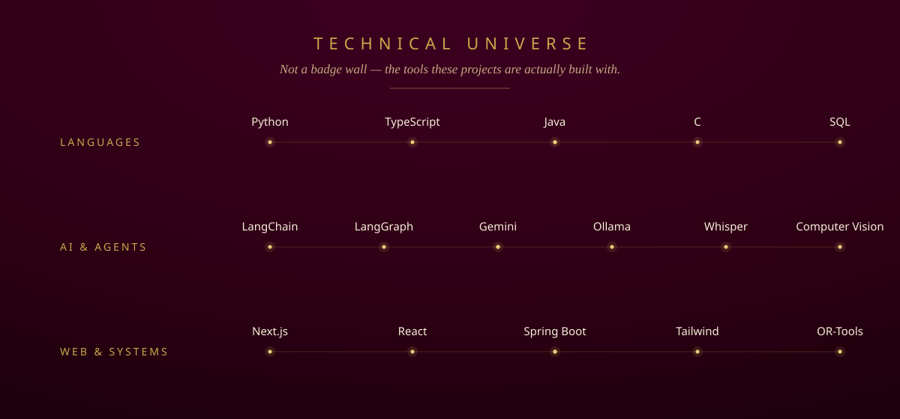

<!--
  Isha Joshi · GitHub profile README
  Design language translated from https://isha-gold.vercel.app
  Palette: wine #2d0014 · gold #c9a84c/#e8c97a · cream #f5edd8 · rose #ff4d6d
  Field Notes are generated from data/activity.json by scripts/render_activity.py
-->

**Final-year BSc Computer Science · Pune · 9+ CGPA**

I work at the seam where art and technology stop being opposites.
A dancer who writes classifiers, a reader who ships products —
I like solving problems more than I like knowing answers.

*Rabbit holes > reality.*

## &nbsp;&nbsp;&nbsp;✦&nbsp;&nbsp;Field Notes

What I'm actually doing — field notes, not a commit log. &nbsp;·&nbsp; `LIVE` now · `BUILDING` in progress · `EXPLORING` researching · `UPCOMING` next · `COMPLETED` shipped

<!-- FIELD-NOTES:START -->

**&#9670;&nbsp; Now**

- `LIVE` &nbsp;**Cyber Shiksha for Cyber Suraksha** — Serving as Secretary of the Quick Heal Foundation club — coordinating awareness drives, events, and the team that runs them.  
  _Cybersecurity · Leadership_ · [story ↗](https://isha-gold.vercel.app/leadership)

**September 2026**

- `BUILDING` &nbsp;**live-meeting-notes** — An offline pipeline that turns any meeting into structured Obsidian notes as you speak — Whisper transcribes, a local LLM pulls out decisions and action items.  
  _AI · Local-first_ · [repo ↗](https://github.com/ishaj306/live-meeting-notes)

**August 2026**

- `EXPLORING` &nbsp;**HastaMudra — learning mode** — Teaching a model to recognise 52 Kathak hasta mudras and grade a performed gesture against a measurable definition.  
  _Creative tech · Computer vision_ · [repo ↗](https://github.com/ishaj306/HastaMudra)
- `COMPLETED` &nbsp;**SkillScope** — Reads real internship-market data to surface the skills companies actually ask for, then maps a profile's gaps — no invented numbers.  
  _Data · Product_ · [repo ↗](https://github.com/ishaj306/SkillScope)
- `COMPLETED` &nbsp;**AcadFlow** — Lab timetables and practical batches generated by a deterministic OR-Tools solver, not a language model — shipped and deployed.  
  _Systems · Optimisation_ · [live ↗](https://acad-flow-ten.vercel.app)
- `EXPLORING` &nbsp;**AURA** — A team of LLM agents — planner, researcher, analyst, critic — that research a question and review each other before answering.  
  _AI · Agents_ · [repo ↗](https://github.com/ishaj306/aura)

<!-- FIELD-NOTES:END -->

Older notes → **[the full archive](ACTIVITY.md)**.

## &nbsp;&nbsp;&nbsp;✦&nbsp;&nbsp;Selected Work

> I don't list technologies — I tell stories. The problem, why I built it, and what it taught me.

### &nbsp;&nbsp;⟡&nbsp; Flagship — where the dancer and the engineer meet

**[HastaMudra](https://github.com/ishaj306/HastaMudra)** &nbsp;·&nbsp; computer vision for classical dance

Recognition of **52 Kathak Hasta Mudras** across single- and double-hand categories, with a *learning mode* that grades a performed gesture against a measurable definition — the software equivalent of a guru correcting your hand, one landmark at a time.

`Python` · `Computer Vision` · `scikit-learn` · `hand-landmark features`

### &nbsp;&nbsp;⟡&nbsp; From the laboratory

<table>
  <tr>
    <td width="50%" valign="top">

**[AURA](https://github.com/ishaj306/aura)**
*Autonomous Understanding & Research Agent*

A team of specialized agents — Planner, Researcher, Analyst, Critic — that research a question with tools and review each other's work before answering.

`LangChain` · `LangGraph` · `Gemini`

  </td>
    <td width="50%" valign="top">

**[SkillScope](https://github.com/ishaj306/SkillScope)**
*Internship market & skill-gap analyzer*

Reads real job-posting data to find the skills companies actually ask for — then maps your profile against the market. No invented numbers.

`Next.js` · `TypeScript` · `Tailwind`

  </td>
  </tr>
  <tr>
    <td width="50%" valign="top">

**[AcadFlow](https://github.com/ishaj306/AcadFlow)** &nbsp;·&nbsp; [live ↗](https://acad-flow-ten.vercel.app)
*Timetable & batch generator*

Lab timetables produced by a **deterministic constraint solver**, not a language model — hard constraints that can't be traded away, soft ones as a weighted objective.

`Java` · `Spring Boot` · `React` · `OR-Tools CP-SAT`

  </td>
    <td width="50%" valign="top">

**[live-meeting-notes](https://github.com/ishaj306/live-meeting-notes)**
*Meetings → structured notes, live*

Turns any meeting into live Obsidian notes that rewrite themselves as you talk — key points, decisions, action items. **100% offline.**

`Python` · `faster-whisper` · `Ollama`

  </td>
  </tr>
</table>

### &nbsp;&nbsp;⟡&nbsp; Shipped &amp; live

<table>
  <tr>
    <td valign="top"><b>Pawn to Queen</b> A chess tracker that treats progress as a journey, not a stat sheet. Syncs Chess.com &amp; Lichess. <a href="https://pawn-to-queen.vercel.app/">live demo ↗</a> · <a href="https://isha-gold.vercel.app/projects/pawn-to-queen">case study</a></td>
    <td valign="top"><b>Kathak Journal</b> A quiet digital workspace for a classical dancer — bols, compositions, guru notes, practice log. <a href="https://katthak-journal.vercel.app/">live demo ↗</a> · <a href="https://isha-gold.vercel.app/projects/kathak-journal">case study</a></td>
    <td valign="top"><b>Website Redesign</b> A production site rebuilt end to end during my internship — palette and type up to deploy. <a href="https://moash.co.in/">live ↗</a> · <a href="https://isha-gold.vercel.app/projects/website-redesign">case study</a></td>
  </tr>
</table>

## &nbsp;&nbsp;&nbsp;✦&nbsp;&nbsp;Technical Universe

## &nbsp;&nbsp;&nbsp;✦&nbsp;&nbsp;Beyond Code

The things that make the work what it is — not hobbies *around* the work.

| | | |
|---|---|---|
| **Kathak** | Madhyama level · 8 years, daily | Precision and discipline, learned in the body before the code. |
| **Reading** | 200+ books | I read like some people breathe — steadily, hungrily. |
| **Crochet** | stitch by stitch | Keeps me honest about what craftsmanship actually means. |

More at [isha-gold.vercel.app](https://isha-gold.vercel.app) — reading · kathak · crochet.

## &nbsp;&nbsp;&nbsp;✦&nbsp;&nbsp;Find Me

 

